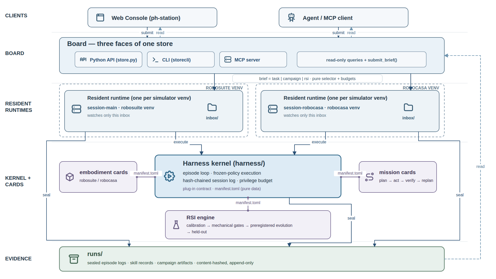

<p align="center">
  <picture>
    <source media="(prefers-color-scheme: dark)" srcset="images/zlab-logo.webp">
    
  </picture>
</p>

<h1 align="center">physical-harness</h1>

<p align="center">
  
  
  
  
  
  
  
</p>

<p align="center">English | <a href="README.zh.md">简体中文</a></p>

**An agentic harness for robot skills: frozen-policy execution, sealed evidence, and pre-registered skill evolution.**

physical-harness is a sim-agnostic host for agentic robot skills. Its base is a small kernel with
exactly two layers — an **execution** layer (claim a task and run it under governance) and an
**evolution** layer (offline recursive self-improvement that accrues evidence). Everything else —
skills, models, packages, the robot embodiment, the operator UI — is a hot-pluggable card. Every
published number comes from a real robosuite/MuJoCo (or RoboCasa) rollout: no mocked verification,
no external API calls, and no privileged shortcut that is not metered against a budget. A skill is
"integrated" only when it ships a `SkillRecord` that has cleared the full evidence pipeline
(paired same-seed gate, blind twin, held-out block, privilege ablation, hash-chained ledger) —
not a demo. The kernel's original contribution is **mechanizing the privilege budget**: every
privileged feature read and capability resolve is charged, so the sim-to-real gap becomes a
measurable ablation curve rather than a worry.

Charter: [GOAL.md](GOAL.md) · internals: [ARCHITECTURE.md](ARCHITECTURE.md) · agent handbook:
[CLAUDE.md](CLAUDE.md). These three files anchor the project's direction and
rules — do not modify them lightly; GOAL.md in particular is fixed and changes
only by the operator's decision.

## Architecture



Capability seams are the manifest in `harness/definitions.py`; contracts are the
`runtime_checkable` Protocols in `harness/contracts.py`, so a wrong-shaped provider fails at
mount, not mid-episode. The kernel does five things: it charges every resolve (privileged reads
consume budget), structurally validates every contract mount, folds config into a `MountPlan.sha`
(mount = experiment identity), chains the `SessionLog` (any in-place tamper breaks the chain), and
isolates percept so critic and recovery only touch a metered `FeatureView`. The kernel imports no
plugin and plugins never import each other (cross-plugin references are registry strings), both
enforced by AST tests.

## External libraries

The **base** install pulls only two runtime dependencies. Everything heavy is an optional extra
or a separate sim venv. Full manifest: [requirements.md](requirements.md).

| Library | Version | Extra / venv | For | License |
|---|---|---|---|---|
| numpy | >=1.26 | base | arrays, RNG, the whole numeric core | BSD-3 |
| pytest, pytest-timeout | >=8, >=2 | `[dev]` | test runner | MIT |
| ruff | ==0.16.4 | `[dev]` | lint/format | MIT |
| mcp | ==2.0.0 | `[dev]`, `[cockpit]` | `board/mcp_server.py` stdio JSON-RPC seam | MIT |
| mujoco | ==3.3.7 | `[embodiment_robosuite]` (.venv) | sim physics — pinned (>=3.4 renames `qM`→`M`) | Apache-2.0 |
| robosuite | ==1.5.2 | `[embodiment_robosuite]` (.venv) | Panda/Sawyer manipulation env | MIT |
| robosuite | master @5ce6643 | robocasa-venv | RoboCasa needs `load_model_on_init` (not in 1.5.2) | MIT |
| robocasa | 1.0.1 @a07e365 | robocasa-venv | long-horizon kitchen missions (+23 GB assets) | MIT |
| mujoco / numpy | 3.3.1 / 2.2.5 | robocasa-venv | RoboCasa hard-pins; numpy 2.x ABI is why it can't share .venv | Apache / BSD |
| libero | master @8f1084e | libero-venv (py3.10) | VLA benchmark suite (assets bundled in-repo, ~405 MB) | MIT |
| robosuite / mujoco / numpy | 1.4.0 / 2.3.2 / 1.22.4 | libero-venv | LIBERO's 2022-era pins; see docs/sim-adaptation.md §5 | MIT / Apache / BSD |

The **operator UI companion** ([ph-station](https://github.com/Z-Robotics-Lab/ph-station)) is an
MIT-licensed cockpit on a Node 22 + pnpm toolchain (dockview-react, tabler-icons). It is installed
separately — see its README.

## Install

**Base harness (no GPU, no network, no API key):**

```bash
uv venv && uv pip install -e ".[dev]"     # base deps = numpy only, plus test tools
python -m pytest -m "not robosuite and not robocasa"   # base lane
```

The base boots and passes its own lane on a machine where the sim cards are absent — that is the
whole point of a sim-agnostic kernel. The sim stacks are **separate venvs** because their numpy
ABIs (1.x vs 2.x) cannot coexist:

**robosuite card** (in `.venv`, py3.12): add the extra —
`uv pip install -e ".[embodiment_robosuite]"`. `mujoco==3.3.7 + robosuite==1.5.2` are hard pins.
Headless Linux needs `MUJOCO_GL=egl` (macOS must NOT set it).

**RoboCasa card** (separate venv, py3.12, ~23 GB assets) — see
[docs/sim-adaptation.md](docs/sim-adaptation.md) and [requirements.md](requirements.md) for the
full recipe. Two traps to know up front:

- robosuite master installs as a PEP-660 editable whose `__file__` is `None` and crashes robosuite
  itself — reinstall with
  `pip install -e . --config-settings editable_mode=compat --no-deps`.
- The RoboCasa repo root is named `robocasa/`, so any process whose cwd can see it imports the
  **namespace package** and 374 kitchen envs silently fail to register. Always run the RoboCasa
  runtime with `cwd = physical-harness` (no `robocasa/` dir there). Asset download is interactive;
  pipe `yes`: `yes y | python -m robocasa.scripts.download_kitchen_assets`.

**Operator UI:** the [ph-station](https://github.com/Z-Robotics-Lab/ph-station) cockpit is Node 22
+ pnpm; it is not launched standalone — `scripts/cockpit` builds it and serves it. The panels read
the board over MCP and `POST /api/board/<fn>`; briefs go in via `submit_brief`.

## Run

```bash
scripts/cockpit          # start resident runtime + ph-station UI @ :3080, both left alive
scripts/cockpit --stop   # stop only the two this invocation started (exact pidfile PIDs)
```

The runtime is **adopt-or-spawn**: it claims an existing runtime on a session dir or spawns one
and records its PID for exact reclaim (never pattern-kills). One session dir, never two runtimes.
`--render` adds a live window only if `$DISPLAY` is set (it hard-refuses headless and never
silently falls back) and is orthogonal to mode.

## Execution and evolution modes

A session defaults to **execution** (a fail-safe: a real task never triggers self-improvement).
`--mode evolution` is the only state that writes sealed records; execution mounts frozen
`SkillRecord`s and a frozen config and writes nothing. The mode is written once to a `MODE` file,
asserted equal on restart, and sealed into chain row 0 — tampering breaks the chain, and a broken
chain is the audit signal.

## Reproduce a published result

```bash
PYTHONPATH=. MUJOCO_GL=egl .venv/bin/python scripts/parity_check.py <archived_campaign_dir>
```

This re-runs a sealed campaign through the kernel path and byte-compares every per-generation rule
canonical, bundle sha, dev/blind gate, and held-out paired field. Evidence discipline, the
plugin/card model, and how to write a card all live in [ARCHITECTURE.md](ARCHITECTURE.md) and
[GOAL.md](GOAL.md).

## Tests

Always use `python -m pytest` (not `bin/pytest`, which drops cwd from `sys.path` and yields
spurious collection errors). The **base fast lane** is `pytest -m "not robosuite and not
robocasa"`, run isolated with the sim cards absent: **633 passed, 32 skipped, 28 deselected**.
The snapshot format and the isolation recipe are in [docs/base-gate.md](docs/base-gate.md); refresh
that file and this line in the same commit whenever the count moves.
