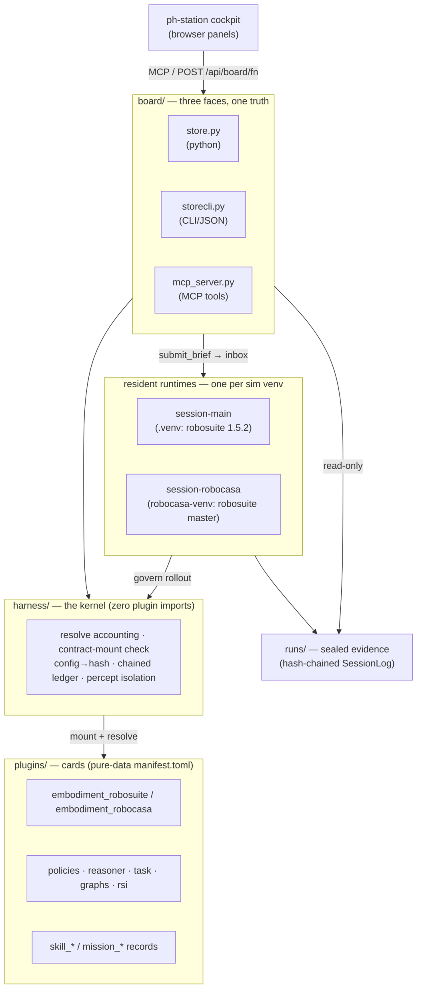

# physical-harness

**A plugin kernel that carries one evidence machine for robot-skill agents.**

physical-harness is a host motherboard for agentic robot skills. The base is a small,
sim-agnostic kernel with exactly two welded layers — an **execution** layer (claim a task, run
it under governance) and an **evolution** layer (offline RSI that accrues evidence). Everything
else — skills, models, packages, the robot embodiment, the operator UI — is a hot-pluggable
card. Every published number comes from a real robosuite/MuJoCo (or RoboCasa) rollout: no
mocked verification, no external API calls, no privileged shortcut that isn't metered against a
budget. A skill is "integrated" only when it ships a `SkillRecord` that cleared the full
evidence pipeline (paired same-seed gate, blind twin, held-out block, privilege ablation,
hash-chained ledger) — not a demo.

Design provenance: the everything-is-a-plugin kernel is from **dsh** (deepseek-harness); the
physical-RSI workload (freeze the policy, evolve the critic/recovery) is from **Zetta**; the
original contribution is **mechanizing the privilege budget** — every privileged feature read
and capability resolve is charged, so sim-to-real gap becomes a measurable ablation curve
instead of a worry.

Charter: [GOAL.md](GOAL.md) · current state: [STATUS.md](STATUS.md) · internals:
[ARCHITECTURE.md](ARCHITECTURE.md) · agent handbook: [CLAUDE.md](CLAUDE.md).

## Architecture



Capability seams are the manifest in `harness/definitions.py`; contracts are the
`runtime_checkable` Protocols in `harness/contracts.py` — a wrong-shaped provider fails at
mount, not mid-episode. The kernel does five things: charges every resolve (privileged reads
eat budget), structurally validates every contract mount, folds config into a `MountPlan.sha`
(mount = experiment identity), chains the `SessionLog` (in-place tamper breaks the chain), and
isolates percept so critic/recovery only touch a metered `FeatureView`. The kernel imports no
plugin and plugins never import each other (cross-plugin refs are registry strings), both
enforced by AST tests.

## External libraries

The **base** install pulls only two runtime deps. Everything heavy is an optional extra or a
separate sim venv. Full manifest: [requirements.md](requirements.md).

| Library | Version | Extra / venv | For | License |
|---|---|---|---|---|
| numpy | >=1.26 | base | arrays, RNG, the whole numeric core | BSD-3 |
| zstandard | >=0.22 | base | episode-log compression | BSD |
| pytest, pytest-timeout | >=8, >=2 | `[dev]` | test runner | MIT |
| ruff | ==0.16.4 | `[dev]` | lint/format | MIT |
| mcp | ==2.0.0 | `[dev]`, `[cockpit]` | `board/mcp_server.py` stdio JSON-RPC seam | MIT |
| mujoco | ==3.3.7 | `[embodiment_robosuite]` (.venv) | sim physics — pinned (>=3.4 renames `qM`→`M`) | Apache-2.0 |
| robosuite | ==1.5.2 | `[embodiment_robosuite]` (.venv) | Panda/Sawyer manipulation env | MIT |
| robosuite | master @5ce6643 | robocasa-venv | RoboCasa needs `load_model_on_init` (not in 1.5.2) | MIT |
| robocasa | 1.0.1 @a07e365 | robocasa-venv | long-horizon kitchen missions (+23 GB assets) | MIT |
| mujoco / numpy | 3.3.1 / 2.2.5 | robocasa-venv | RoboCasa hard-pins; numpy 2.x ABI is why it can't share .venv | Apache / BSD |

The **UI companion** ([ph-station](https://github.com/Z-Robotics-Lab/ph-station), an MIT dsh
fork) adds a Node 22 + pnpm toolchain (`@deepseek-ai/dsh-*`, dockview-react, tabler-icons).
It is installed separately — see its README.

## Install

**Base harness (no GPU, no network, no API key):**

```bash
uv venv && uv pip install -e ".[dev]"     # base deps = numpy + zstandard, plus test tools
python -m pytest -m "not robosuite and not robocasa"   # base lane
```

The base boots and passes its own lane on a machine where the sim cards are absent — that is
the whole point of a sim-agnostic kernel. The sim stacks are **separate venvs** because their
numpy ABIs (1.x vs 2.x) cannot coexist:

**robosuite card** (in `.venv`, py3.12): add the extra —
`uv pip install -e ".[embodiment_robosuite]"`. `mujoco==3.3.7 + robosuite==1.5.2` are hard
pins. Headless Linux needs `MUJOCO_GL=egl` (macOS must NOT set it).

**RoboCasa card** (separate venv, py3.12, ~23 GB assets) — see
[docs/sim-adaptation.md](docs/sim-adaptation.md) and [requirements.md](requirements.md) for the
full recipe. Two traps to know up front:

- robosuite master installs as a PEP-660 editable whose `__file__` is `None` and crashes
  robosuite itself — reinstall with
  `pip install -e . --config-settings editable_mode=compat --no-deps`.
- The RoboCasa repo root is named `robocasa/`, so any process whose cwd can see it imports the
  **namespace package** and 374 kitchen envs silently fail to register. Always run the RoboCasa
  runtime with `cwd = physical-harness` (no `robocasa/` dir there). Asset download is
  interactive; pipe `yes`: `yes y | python -m robocasa.scripts.download_kitchen_assets`.

**Operator UI:** the [ph-station](https://github.com/Z-Robotics-Lab/ph-station) cockpit is Node 22
+ pnpm; it is not launched standalone — `scripts/cockpit` builds it and serves it. The panels
read the board over MCP and `POST /api/board/<fn>`; briefs go in via `submit_brief`.

## Run

```bash
scripts/cockpit          # start resident runtime + ph-station UI @ :3080, both left alive
scripts/cockpit --stop   # stop only the two this invocation started (exact pidfile PIDs)
```

The runtime is **adopt-or-spawn**: it claims an existing runtime on a session dir or spawns one
and records its PID for exact reclaim (never pattern-kills). One session dir, never two
runtimes. `--render` adds a live window IFF `$DISPLAY` is set (hard-refuses headless, never
silently falls back) and is orthogonal to mode.

## Two-state law

A session defaults to **EXECUTION** (fail-safe: a real task never triggers RSI). `--mode
evolution` is the only state that writes sealed records; execution mounts frozen `SkillRecord`s
and a frozen config and writes nothing. Mode is written once to a `MODE` file, asserted equal on
restart, and sealed into chain row 0 — tampering breaks the chain, and a broken chain is the
audit.

## Reproduce a published result

```bash
PYTHONPATH=. MUJOCO_GL=egl .venv/bin/python scripts/parity_check.py <archived_campaign_dir>
```

Re-runs a sealed campaign through the kernel path and byte-compares every per-generation rule
canonical, bundle sha, dev/blind gate, and held-out paired field. Evidence discipline, the
plugin/card model, and how to write a card all live in [ARCHITECTURE.md](ARCHITECTURE.md) and
[GOAL.md](GOAL.md).

## Tests

Always `python -m pytest` (not `bin/pytest` — it drops cwd from `sys.path` and yields spurious
collection errors). The **base fast lane** is `pytest -m "not robosuite and not robocasa"`, run
isolated (sim cards absent): **605 passed, 29 skipped, 28 deselected**. Snapshot format and the
isolation recipe are in [docs/base-gate.md](docs/base-gate.md) — refresh it and this line in the
same commit whenever the count moves.
