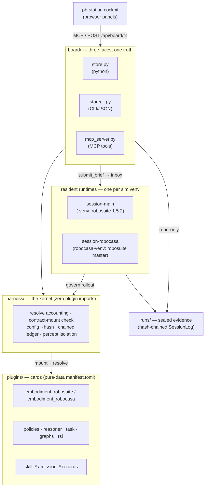
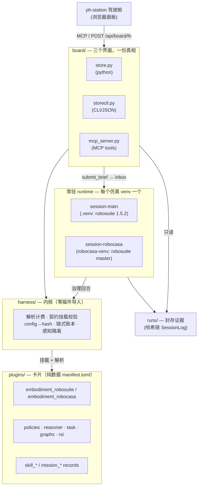

# physical-harness

      

English | [简体中文](#简体中文)

**An agentic harness for robot skills: frozen-policy execution, sealed evidence, and pre-registered skill evolution.**

physical-harness is a sim-agnostic host for agentic robot skills. Its base is a small kernel with
exactly two layers — an **execution** layer (claim a task and run it under governance) and an
**evolution** layer (offline recursive self-improvement that accrues evidence). Everything else —
skills, models, packages, the robot embodiment, the operator UI — is a hot-pluggable card. Every
published number comes from a real robosuite/MuJoCo (or RoboCasa) rollout: no mocked verification,
no external API calls, and no privileged shortcut that is not metered against a budget. A skill is
"integrated" only when it ships a `SkillRecord` that has cleared the full evidence pipeline
(paired same-seed gate, blind twin, held-out block, privilege ablation, hash-chained ledger) —
not a demo. The kernel's original contribution is **mechanizing the privilege budget**: every
privileged feature read and capability resolve is charged, so the sim-to-real gap becomes a
measurable ablation curve rather than a worry.

Charter: [GOAL.md](GOAL.md) · internals: [ARCHITECTURE.md](ARCHITECTURE.md) · agent handbook:
[CLAUDE.md](CLAUDE.md). These three files anchor the project's direction and
rules — do not modify them lightly; GOAL.md in particular is fixed and changes
only by the operator's decision.

## Architecture



Capability seams are the manifest in `harness/definitions.py`; contracts are the
`runtime_checkable` Protocols in `harness/contracts.py`, so a wrong-shaped provider fails at
mount, not mid-episode. The kernel does five things: it charges every resolve (privileged reads
consume budget), structurally validates every contract mount, folds config into a `MountPlan.sha`
(mount = experiment identity), chains the `SessionLog` (any in-place tamper breaks the chain), and
isolates percept so critic and recovery only touch a metered `FeatureView`. The kernel imports no
plugin and plugins never import each other (cross-plugin references are registry strings), both
enforced by AST tests.

## External libraries

The **base** install pulls only two runtime dependencies. Everything heavy is an optional extra
or a separate sim venv. Full manifest: [requirements.md](requirements.md).

| Library | Version | Extra / venv | For | License |
|---|---|---|---|---|
| numpy | >=1.26 | base | arrays, RNG, the whole numeric core | BSD-3 |
| pytest, pytest-timeout | >=8, >=2 | `[dev]` | test runner | MIT |
| ruff | ==0.16.4 | `[dev]` | lint/format | MIT |
| mcp | ==2.0.0 | `[dev]`, `[cockpit]` | `board/mcp_server.py` stdio JSON-RPC seam | MIT |
| mujoco | ==3.3.7 | `[embodiment_robosuite]` (.venv) | sim physics — pinned (>=3.4 renames `qM`→`M`) | Apache-2.0 |
| robosuite | ==1.5.2 | `[embodiment_robosuite]` (.venv) | Panda/Sawyer manipulation env | MIT |
| robosuite | master @5ce6643 | robocasa-venv | RoboCasa needs `load_model_on_init` (not in 1.5.2) | MIT |
| robocasa | 1.0.1 @a07e365 | robocasa-venv | long-horizon kitchen missions (+23 GB assets) | MIT |
| mujoco / numpy | 3.3.1 / 2.2.5 | robocasa-venv | RoboCasa hard-pins; numpy 2.x ABI is why it can't share .venv | Apache / BSD |

The **operator UI companion** ([ph-station](https://github.com/Z-Robotics-Lab/ph-station)) is an
MIT-licensed cockpit on a Node 22 + pnpm toolchain (dockview-react, tabler-icons). It is installed
separately — see its README.

## Install

**Base harness (no GPU, no network, no API key):**

```bash
uv venv && uv pip install -e ".[dev]"     # base deps = numpy only, plus test tools
python -m pytest -m "not robosuite and not robocasa"   # base lane
```

The base boots and passes its own lane on a machine where the sim cards are absent — that is the
whole point of a sim-agnostic kernel. The sim stacks are **separate venvs** because their numpy
ABIs (1.x vs 2.x) cannot coexist:

**robosuite card** (in `.venv`, py3.12): add the extra —
`uv pip install -e ".[embodiment_robosuite]"`. `mujoco==3.3.7 + robosuite==1.5.2` are hard pins.
Headless Linux needs `MUJOCO_GL=egl` (macOS must NOT set it).

**RoboCasa card** (separate venv, py3.12, ~23 GB assets) — see
[docs/sim-adaptation.md](docs/sim-adaptation.md) and [requirements.md](requirements.md) for the
full recipe. Two traps to know up front:

- robosuite master installs as a PEP-660 editable whose `__file__` is `None` and crashes robosuite
  itself — reinstall with
  `pip install -e . --config-settings editable_mode=compat --no-deps`.
- The RoboCasa repo root is named `robocasa/`, so any process whose cwd can see it imports the
  **namespace package** and 374 kitchen envs silently fail to register. Always run the RoboCasa
  runtime with `cwd = physical-harness` (no `robocasa/` dir there). Asset download is interactive;
  pipe `yes`: `yes y | python -m robocasa.scripts.download_kitchen_assets`.

**Operator UI:** the [ph-station](https://github.com/Z-Robotics-Lab/ph-station) cockpit is Node 22
+ pnpm; it is not launched standalone — `scripts/cockpit` builds it and serves it. The panels read
the board over MCP and `POST /api/board/<fn>`; briefs go in via `submit_brief`.

## Run

```bash
scripts/cockpit          # start resident runtime + ph-station UI @ :3080, both left alive
scripts/cockpit --stop   # stop only the two this invocation started (exact pidfile PIDs)
```

The runtime is **adopt-or-spawn**: it claims an existing runtime on a session dir or spawns one
and records its PID for exact reclaim (never pattern-kills). One session dir, never two runtimes.
`--render` adds a live window only if `$DISPLAY` is set (it hard-refuses headless and never
silently falls back) and is orthogonal to mode.

## Execution and evolution modes

A session defaults to **execution** (a fail-safe: a real task never triggers self-improvement).
`--mode evolution` is the only state that writes sealed records; execution mounts frozen
`SkillRecord`s and a frozen config and writes nothing. The mode is written once to a `MODE` file,
asserted equal on restart, and sealed into chain row 0 — tampering breaks the chain, and a broken
chain is the audit signal.

## Reproduce a published result

```bash
PYTHONPATH=. MUJOCO_GL=egl .venv/bin/python scripts/parity_check.py <archived_campaign_dir>
```

This re-runs a sealed campaign through the kernel path and byte-compares every per-generation rule
canonical, bundle sha, dev/blind gate, and held-out paired field. Evidence discipline, the
plugin/card model, and how to write a card all live in [ARCHITECTURE.md](ARCHITECTURE.md) and
[GOAL.md](GOAL.md).

## Tests

Always use `python -m pytest` (not `bin/pytest`, which drops cwd from `sys.path` and yields
spurious collection errors). The **base fast lane** is `pytest -m "not robosuite and not
robocasa"`, run isolated with the sim cards absent: **605 passed, 29 skipped, 28 deselected**.
The snapshot format and the isolation recipe are in [docs/base-gate.md](docs/base-gate.md); refresh
that file and this line in the same commit whenever the count moves.

---

## 简体中文

**面向机器人技能的智能体化框架：冻结策略执行、证据封存、预注册的技能演化。**

physical-harness 是一个与仿真环境解耦的机器人技能宿主。它的基座是一个小型内核，只有两层——
**执行**层（领取任务并在治理下运行）与**演化**层（离线的递归自我提升，持续积累证据）。其余的一切
——技能、模型、依赖包、机器人本体、操作员界面——都是可热插拔的卡片。每一个对外公布的数字都来自真实的
robosuite/MuJoCo（或 RoboCasa）回合：没有伪造的验证，没有外部 API 调用，也没有任何未按预算计量的特权
捷径。只有当一项技能交付了通过完整证据流水线（同种子配对门禁、盲测孪生、留出块、特权消融、哈希链账本）
的 `SkillRecord` 时，它才算「已集成」——而不是一个演示。内核的原创贡献在于**将特权预算机制化**：每一次
特权特征读取与能力解析都会被计费，于是 sim-to-real 差距变成一条可测量的消融曲线，而不再是一种担忧。

宪章见 [GOAL.md](GOAL.md) · 内部结构见 [ARCHITECTURE.md](ARCHITECTURE.md) · 智能体手册见
[CLAUDE.md](CLAUDE.md)。这三份文件锚定项目的方向与规则，请勿轻易修改；GOAL.md 是固定的，
只能由操作员决定变更。

### 架构



能力接缝是 `harness/definitions.py` 里的清单；契约是 `harness/contracts.py` 里的
`runtime_checkable` Protocol——形状不对的 provider 会在挂载时失败，而不是在回合中途。内核只做五件事：
对每次解析计费（特权读取消耗预算）、结构化校验每次契约挂载、把 config 折算进 `MountPlan.sha`
（挂载即实验身份）、串联 `SessionLog`（任何原地篡改都会断链）、隔离感知使 critic 与 recovery 只能触及
被计量的 `FeatureView`。内核不导入任何插件，插件之间也从不互相导入（跨插件引用一律是注册表字符串），二者
均由 AST 测试强制保证。

### 外部依赖

**基座**安装仅拉取两个运行时依赖。所有重量级组件都是可选 extra 或独立的仿真 venv。完整清单见
[requirements.md](requirements.md)。

| 库 | 版本 | Extra / venv | 用途 | 许可证 |
|---|---|---|---|---|
| numpy | >=1.26 | base | 数组、RNG，整个数值核心 | BSD-3 |
| pytest, pytest-timeout | >=8, >=2 | `[dev]` | 测试运行器 | MIT |
| ruff | ==0.16.4 | `[dev]` | lint/format | MIT |
| mcp | ==2.0.0 | `[dev]`, `[cockpit]` | `board/mcp_server.py` 的 stdio JSON-RPC 接缝 | MIT |
| mujoco | ==3.3.7 | `[embodiment_robosuite]` (.venv) | 仿真物理——已固定（>=3.4 会把 `qM` 改名为 `M`） | Apache-2.0 |
| robosuite | ==1.5.2 | `[embodiment_robosuite]` (.venv) | Panda/Sawyer 操作环境 | MIT |
| robosuite | master @5ce6643 | robocasa-venv | RoboCasa 需要 `load_model_on_init`（1.5.2 没有） | MIT |
| robocasa | 1.0.1 @a07e365 | robocasa-venv | 长时序厨房任务（+23 GB 资产） | MIT |
| mujoco / numpy | 3.3.1 / 2.2.5 | robocasa-venv | RoboCasa 硬固定；numpy 2.x ABI 正是它无法共用 .venv 的原因 | Apache / BSD |

**操作员界面伴侣**（[ph-station](https://github.com/Z-Robotics-Lab/ph-station)）是一个基于 Node 22
+ pnpm 工具链（dockview-react、tabler-icons）的 MIT 许可驾驶舱，独立安装——详见其 README。

### 安装

**基座（无 GPU、无网络、无 API key）：**

```bash
uv venv && uv pip install -e ".[dev]"     # 基座依赖 = 仅 numpy，加测试工具
python -m pytest -m "not robosuite and not robocasa"   # 基座车道
```

在仿真卡片缺席的机器上，基座也能启动并通过自己的测试车道——这正是与仿真解耦的内核的意义所在。仿真栈之所以
是**独立 venv**，是因为它们的 numpy ABI（1.x 与 2.x）无法共存：

**robosuite 卡片**（在 `.venv`，py3.12）：添加 extra——
`uv pip install -e ".[embodiment_robosuite]"`。`mujoco==3.3.7 + robosuite==1.5.2` 为硬固定。
无头 Linux 需要 `MUJOCO_GL=egl`（macOS 一定不要设）。

**RoboCasa 卡片**（独立 venv，py3.12，约 23 GB 资产）——完整流程见
[docs/sim-adaptation.md](docs/sim-adaptation.md) 与 [requirements.md](requirements.md)。有两个坑
需要提前知道：

- robosuite master 会以 PEP-660 editable 形式安装，其 `__file__` 为 `None`，会让 robosuite 自身
  崩溃——需以
  `pip install -e . --config-settings editable_mode=compat --no-deps` 重装。
- RoboCasa 仓库根目录名为 `robocasa/`，任何 cwd 能看到它的进程都会导入**命名空间包**，导致 374 个
  厨房环境静默注册失败。始终以 `cwd = physical-harness`（那里没有 `robocasa/` 目录）运行 RoboCasa
  runtime。资产下载是交互式的，用 `yes` 管道：
  `yes y | python -m robocasa.scripts.download_kitchen_assets`。

**操作员界面：** [ph-station](https://github.com/Z-Robotics-Lab/ph-station) 驾驶舱基于 Node 22
+ pnpm；它不独立启动——由 `scripts/cockpit` 构建并托管。面板通过 MCP 与 `POST /api/board/<fn>`
读取 board；brief 经由 `submit_brief` 投入。

### 运行

```bash
scripts/cockpit          # 启动常驻 runtime + ph-station UI @ :3080，二者保持存活
scripts/cockpit --stop   # 只停止本次调用启动的两个进程（按 pidfile 精确 PID）
```

runtime 采用**领养或派生**：它要么认领某个 session 目录上已有的 runtime，要么派生一个并记录其 PID
以便精确回收（从不按模式 kill）。一个 session 目录，绝不并存两个 runtime。`--render` 仅在设置了
`$DISPLAY` 时才加上实时窗口（无头环境下硬拒绝，绝不静默回退），且与模式正交。

### 执行态与演化态

session 默认为**执行态**（一种 fail-safe：真实任务绝不触发自我提升）。`--mode evolution` 是唯一会
写入封存记录的状态；执行态挂载冻结的 `SkillRecord` 与冻结的 config，不写入任何东西。模式被一次性写入
`MODE` 文件，在重启时断言相等，并封入链的第 0 行——篡改会断链，而断链本身就是审计信号。

### 复现一个已发布结果

```bash
PYTHONPATH=. MUJOCO_GL=egl .venv/bin/python scripts/parity_check.py <archived_campaign_dir>
```

它将一个封存 campaign 沿内核路径重跑，并逐字节比对每一代的规则规范、bundle sha、dev/blind 门禁与
留出块配对字段。证据纪律、插件/卡片模型以及如何编写一张卡片，都在
[ARCHITECTURE.md](ARCHITECTURE.md) 与 [GOAL.md](GOAL.md) 中。

### 测试

始终使用 `python -m pytest`（不要用 `bin/pytest`，它会把 cwd 从 `sys.path` 中移除并产生虚假的
收集错误）。**基座快车道**是 `pytest -m "not robosuite and not robocasa"`，在仿真卡片缺席的隔离
环境下运行：**605 passed, 29 skipped, 28 deselected**。快照格式与隔离流程见
[docs/base-gate.md](docs/base-gate.md)；每当计数变动时，请在同一个 commit 中刷新该文件与本行。
